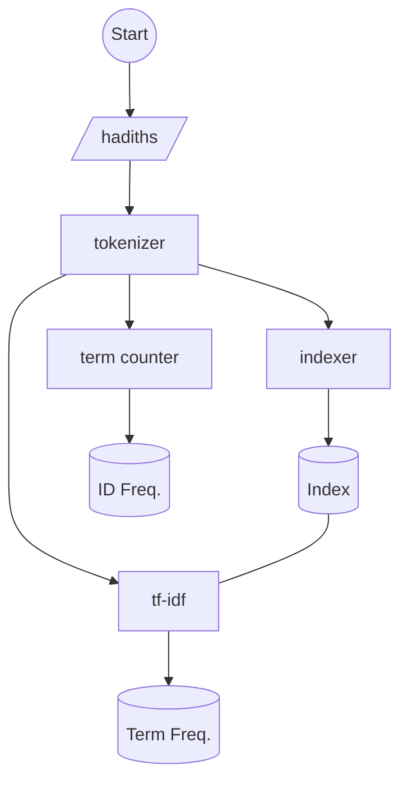
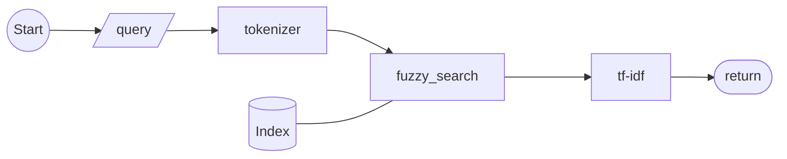

# Sunnah Search Engine

Sunnah Search will be a search engine for hadiths from multiple sources and authenticity levels.

## Features

- Filter & Rank hadiths based on a query
- Support for fuzzy search

## Stack

- Rust
- tf-idf
- JSON

## **Strategy**

### Preprocessing

1. Compile a list of hadiths 
2. Serialize an index of the hadiths; e.g. `token → [id1, id25]`
3. Serialize a hashmap of the *idf* of each token; e.g. `token → 123`
4. Serialize a hashmap for the *term frequencies*; e.g. `hadith → [{token, tf}]`

### Querying

1. List all tokens in the query
2. Fuzzy search the index hashmap
3. Apply tf-idf
4. Return the result

